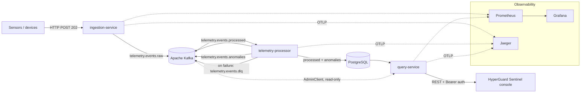

# HyperGuard

**A cloud-native platform for industrial IoT telemetry: ingest sensor readings at burst rate, detect
anomalies as they stream past, correlate them into incidents, and put them in front of an operator in
seconds.**

Sensors on an industrial site do not emit at a steady pace — they go quiet for minutes, then send a
burst. A synchronous write-to-database path either drops those bursts or slows every sensor down to
the speed of the database. HyperGuard decouples the two with an event log: ingestion accepts and
acknowledges, processing happens downstream at its own pace, and nothing is lost in between.

---

## Architecture



### Services

| Service | Port | Role |
| :--- | :--- | :--- |
| `ingestion-service` | 8081 | Write API. Validates the payload, publishes to Kafka, answers `202 Accepted`. |
| `telemetry-processor` | 8082 (mgmt 9083) | Consumes raw events, normalizes, detects anomalies, persists, correlates incidents. |
| `query-service` | 8083 | Read API. Paged queries, aggregates, incidents, quarantine, authentication. |
| `web-ui` | 5173 / 8090 | **HyperGuard Sentinel** — the operator console (React + Vite + Tailwind). |

---

## How a reading travels

1. **Ingest.** `POST /api/v1/events` with a JSON telemetry event. Bean Validation rejects a malformed
   payload with `400` and a field-by-field error body *before* anything reaches Kafka. A valid event
   is published to `telemetry.events.raw` keyed by `deviceId` — so every reading from one device
   lands on the same partition and keeps its order — and the caller gets `202 Accepted`. The response
   states that the event was *accepted*, not that it was processed; claiming otherwise would force
   the client to wait for the whole pipeline.

2. **Normalize.** The processor trims and cleans the payload fields into a canonical event.

3. **Quarantine filter.** Readings from a device an operator has quarantined are dropped here —
   before detection, before storage, before alerting — and counted as suppressed.

4. **Detect.** Heuristic rules on the normalized reading:
   - missing critical field (`tenantId`, `deviceId`, `metric`, `value`) → raised severity;
   - value outside the metric's safe band — temperature, humidity, pressure, level, vibration
     (ISO 10816), CO₂ (ASHRAE/OSHA). Every threshold is configurable per deployment;
   - **spike**: a change greater than the configured ratio against that device's previous reading.

5. **Persist and correlate.** A flagged reading is written to `platform.anomalies`, then joined to
   the device's open incident if its previous anomaly falls inside the correlation window — otherwise
   the idle incident is closed and a new one opened. A partial unique index enforces "at most one
   open incident per device", and a concurrent correlation is retried once. A normal reading goes to
   `platform.processed_telemetry`. **Storage happens before publication**, so a record is only
   acknowledged once it is durable.

6. **Serve.** `query-service` reads PostgreSQL through dynamic JPA specifications and returns paged
   DTOs. Entities never leave the service: the DTO layer is what keeps `passwordHash` off the wire
   and keeps a schema migration from breaking the front end.

7. **Display.** The console polls the read API on an interval the server itself advertises, with
   in-flight requests aborted when filters change so a slow response for an old filter can never
   overwrite a newer one.

---

## What this platform proves

### Autoscaling, measured rather than asserted

Horizontal Pod Autoscaling was validated against a real cluster, with the evidence recorded in the
repository:

| Workload | Scale-up | Peak CPU vs 70% target | Scale-down |
| :--- | :--- | :--- | :--- |
| `ingestion-service` | 2 → 3 → 4 → 6 replicas | 306% | proven stabilization ≥ 277 s, then 6 → 2 |
| `telemetry-processor` | 2 → 3 replicas | 105% | proven stabilization ≥ 279 s, then 3 → 2 |

Every one of the 7 ingestion transitions was matched to an exact-size `SuccessfulRescale` event from
the HPA's own UID — so the autoscaler is demonstrably what moved the replicas, not a manual
`kubectl scale` running next to a healthy HPA. Replica counts are read from the **scale subresource**,
never from the Deployment's `status.replicas`, which moves only when the rollout catches up and would
otherwise hand rollout lag to the stabilization measurement as if it were stabilization time. The
stabilization window is measured from the autoscaler's first *recommendation* to scale in — not from
the moment CPU drops below target, which can be minutes earlier. Peak capacity is credited only while
the peak was still requested: replicas that become `Ready` after the target has already moved down
prove nothing about the peak.

### The failure path is built, not assumed

- A publish failure or an unprocessable message is routed to `telemetry.events.dlq` with its cause.
- DLQ replay is **bounded**: per-partition end offsets are captured when replay is triggered, and the
  listener stops when it reaches them, with an idle timeout as a fallback.
- A replayed event that fails again is **not** re-queued to the DLQ — the original record stays as
  the single retry source, which is what stops a replay loop.
- Consumer acknowledgement is per record, and persistence precedes publication, so a database outage
  causes redelivery rather than silent loss.

### Security decisions, with reasons

- Operator passwords are hashed with BCrypt; sessions are server-side tokens, checked on every
  `/api/v1` route except sign-in itself.
- The processor's Actuator surface — which carries the **state-changing** DLQ replay endpoint — is
  served on a separate management port bound to `127.0.0.1`, so triggering bulk replay requires host
  access rather than merely reaching the service port. Only the Kubernetes liveness/readiness probes
  are mirrored onto the main port.
- Kubernetes NetworkPolicies restrict traffic between workloads.

### Observability

Prometheus scrapes each service's Micrometer registry; Grafana dashboards are provisioned as
configuration, not clicked together by hand; OpenTelemetry exports traces to Jaeger over OTLP, and
every log line carries its `trace_id` and `span_id`.

---

## HyperGuard Sentinel — the operator console

Seven screens, all reading the real APIs:

| Screen | What it shows |
| :--- | :--- |
| **Overview** | Live KPIs, multi-stream telemetry chart with a real breach threshold, anomaly feed, service health matrix. |
| **Fleet & Readings** | Filtered, sorted, paged telemetry with a per-device inspector. |
| **Temporal Trends** | Value-over-time plus a spectral and statistical breakdown (DFT, skewness, kurtosis) computed on the real series. |
| **Anomaly Radar** | Polar deviation chart built from real z-scores, drift, volatility and range position. |
| **Forensics & Incidents** | Incidents with a millisecond timeline, real detection latency, and a correlation graph captioned *correlated, not proven causal*. |
| **Simulation Bench** | Publishes a real reading into the pipeline, with a clearly-labelled illustrative waveform preview. |
| **Topology Pipeline** | Partitions, consumer groups and lag read live from the broker's own AdminClient. |

A standing rule governs this console: **every number on screen is either a real measurement or a real
computation on real data.** Where the backend genuinely cannot supply something — machine-learning
classification, Bayesian causal inference, an admin API that does not exist — the UI says so or
labels the element as illustrative instead of inventing a plausible figure.

---

## Stack

| Layer | Technology |
| :--- | :--- |
| Services | Java 17, Spring Boot 3.3.5, Spring Kafka, Spring Data JPA |
| Streaming | Apache Kafka (Confluent 7.6.1), 4 topics |
| Storage | PostgreSQL 16 (schema `platform`, 7 tables) |
| Console | React 18, TypeScript 5.6, Vite 5, Tailwind CSS 3, Recharts |
| Observability | Micrometer, Prometheus 2.54, Grafana 11.1, OpenTelemetry, Jaeger 1.60 |
| Runtime | Docker Compose locally, Kubernetes with HPA and NetworkPolicies |

---

## Running it locally

Infrastructure first — Compose orders it by health checks (Zookeeper → Kafka → PostgreSQL / Redis /
Jaeger → Prometheus → Grafana → topic creation):

```bash
cd infrastructure/docker && docker compose up -d
```

Then the three services, in any order:

```bash
cd services/query-service        && ./mvnw spring-boot:run   # :8083
cd services/ingestion-service    && ./mvnw spring-boot:run   # :8081
cd services/telemetry-processor  && ./mvnw spring-boot:run   # :8082
```

Then the console:

```bash
cd services/web-ui && npm install && npm run dev             # :5173
```

Send a reading:

```bash
curl -X POST http://localhost:8081/api/v1/events \
  -H 'Content-Type: application/json' \
  -d '{"eventId":"demo-1","tenantId":"acme","eventType":"READING",
       "timestamp":"2026-01-01T12:00:00Z","source":"demo","version":"1.0",
       "payload":{"deviceId":"sensor-01","deviceType":"thermostat","metric":"temperature",
                  "value":143.0,"unit":"C","location":"warehouse-A"}}'
```

A value of 143 °C is above the configured maximum, so it is stored as an anomaly and opens an
incident, visible in the console within one refresh cycle.

> **Note on Kafka readiness:** the consumer inside `telemetry-processor` becomes ready a little later
> than its Actuator health endpoint reports `UP`. Events sent immediately after startup can be missed
> — wait roughly ten seconds after health turns green.

---

## Testing

49 test classes across the three services, covering validation, the producer's DLQ fallback, event
normalization, detection thresholds and spike logic, incident correlation including its concurrency
conflict path, DLQ replay bounding, query specifications, and authentication.

```bash
cd services/<service> && ./mvnw test
cd services/web-ui    && npm run typecheck
```

---

## Known limitations

Stated deliberately, because a platform that claims none is not being honest about itself:

- **Trace context does not cross Kafka.** W3C trace context propagates over HTTP between services and
  `baggage` is enabled in preparation, but the trace currently breaks between ingestion and the
  processor. Traces are continuous on either side of that boundary, not through it.
- **Redis is provisioned but not in the data path.** It is reserved for a read cache that is not yet
  wired.
- **Prometheus does not scrape `telemetry-processor` in the Compose setup.** Its management port is
  bound to loopback by design, so a container cannot reach it; a permanently-down target was judged
  worse than no target. Its metrics are reachable from the host.
- **Detection thresholds are conventions, not calibrated values.** A passing autoscaling run confirms
  the configured values behave as configured; it does not calibrate them.

---

## Naming

The platform is **HyperGuard**; the operator console within it is **HyperGuard Sentinel**. Code-level
identifiers — Java packages `com.pulsestream.*`, the Kubernetes namespace and labels — retain the
project's original name, since renaming them would rewrite every import and manifest for no
functional gain.

---

## About

Engineering project developed at **TGCC**, academic year 2025–2026, **EMSI**.

**BAAKKA Monssef**
